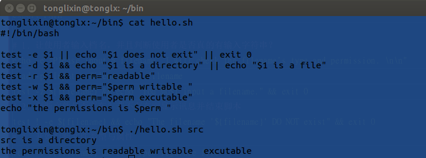
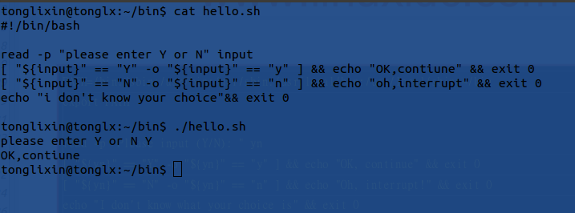
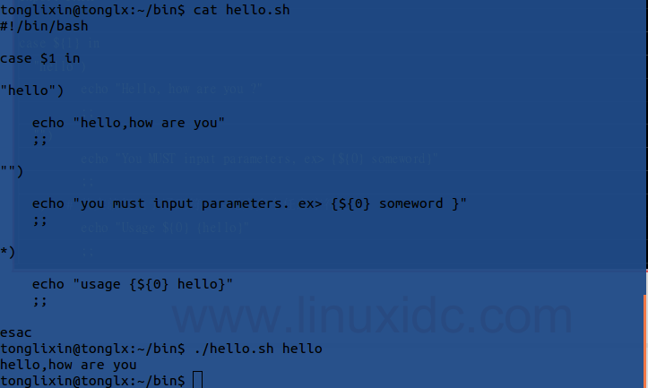

## 0  shell简介

> - Shell是一种具备特殊功能的程序，它提供了用户与内核进行交互操作的一种接口.
    它接收用户输入的命令，并把它送入内核去执行.内核是Linux系统的心脏，从开
    机自检就驻留在计算机的内存中，直到计算机关闭为止，而用户的应用程序存储在
    计算机的硬盘上，仅当需要时才被调入内存.Shell是一种应用程序，当用户登录
    linux系统时，Shell就会被调入内存去执行.Shell独立于内核，**它是连接内
    核和应用程序的桥梁**，并由输入设备读取命令，再将其转为计算机可以理解的机
    械码,Linux内核才能执行该命令.

 > - Shell的作用是解释执行用户的命令，用户输入一条命令，Shell就解释执行一条，
  这种方式称为交互式（Interactive），Shell还有一种执行命令的方式称为批处理
  （Batch），用户事先写一个Shell脚本（Script），其中有很多条命令，让Shell
  一次把这些命令执行完，而不必一条一条地敲命令.

> - Shell脚本和编程语言很相似，也有变量和流程控制语句，但Shell脚本是解释执行
  的，不需要编译，Shell程序从脚本中一行一行读取并执行这些命令，相当于一个用户
  把脚本中的命令一行一行敲到Shell提示符下执行.

> - UNIX系统上有很多版本的Shell，bash是各种Linux发行版标准配置的Shell，在
  Linux系统上/bin/sh往往是指向/bin/bash的符号链接.

- 

## 1  bash shell编写基础

### 1.1 基本格式

程序必须以下面的行开始（必须方在文件的第一行）：

`#!/bin/bash`

符号#!用来告诉系统它后面的参数是用来执行该文件的程序.在这个例子中我们使用/bin/bash来执行程序.

赋予权限 `chmod +x filename`(x:表示可执行的 权限有rwx)

可用以下格式运行：

- /home/tonglixin/bash/hello.sh 以绝对路径下运行脚本

- ./hello.sh  以相对路径下运行

- bash hello.sh

  直接可以执行，甚至这个脚本文件中的第一行都可以不引入/bin/bash，
  它是将hello.sh作为参数传给bash命令来执行的

**script执行方式差异**

1.使用相对/绝对路径或者利用bash、sh下达命令,该scripts会是使用一个新的bash环境来执行,
  该scripts是在子程序的bash执行.也就是说,你在当前bash中试图输出scripts的定义的变量
  显示不存在

2.使用source下达命令，脚本是在当前bash执行,也就是能输出定义变量.

3.由此可以解释当我们需要在当前bash使环境变量生效使用的是source而不是bash

### 1.2 注释

在进行shell编程时，以#开头的句子表示注释，直到这一行的结束.我们真诚地建议您在程序中使用注释.
如果您使用了注释，那么即使相当长的时间内没有使用该脚本，您也能在很短的时间内明白该脚本的作用及
工作原理.

### 1.3 变量

**变量不需要声明，初始化不需要指定类型**

#### 1.3.1 变量命名

- 1 只能使用数字，字母和下划线，且不能以数字开头

- 2 变量名区分大小写

- 3 建议命令要通俗易懂

*注意*:变量赋值是通过等号(=)进行赋值,**在变量、等号和值之间不能出现空格**.

#### 1.3.2 变量使用：`a=10 回车 echo $a echo ${a}`

显示变量值使用echo命令(类似于Java中的system.out) ，加上`$变量名`，也可以使用`${变量名}`

#### 1.3.3 变量分类

Shell变量有这几类：本地变量、环境变量、局部变量、位置变量、特殊变量.

- 1 **本地变量**

    只对当前shell进程有效的，对当前进程的子进程和其它shell进程无效.

    定义：`VAR_NAME=VALUE`

    变量引用：`${VAR_NAME}`或者 `$VAR_NAME`

    取消变量：`unset VAR_NAME`

    若在一个bash命令窗口下再使用bash，则变成了子进程，本地变量不会被这个子进程所访问.

- 2 **环境变量**

    自定义的环境变量对当前shell进程及其子shell进程有效，对其它的shell进程无效

    定义：`export VAR_NAME=VALUE`

    对所有shell进程都有效需要配置到配置文件中

- 3 **局部变量**

    在函数中调用，函数执行结束，变量就会消失
    对shell脚本中某代码片段有效
    定义：`local VAR_NAME=VALUE`
    相当于java代码中某一个方法中定义的局部变量，只对这个方法有效.

- 4 **位置变量**

    比如脚本中的参数：

    $0：脚本自身

    $1：脚本的第一个参数

    $2：脚本的第二个参数

    相当于java中main函数中的args参数，可以获取外部参数.

- 5 特殊变量

    $?：接收上一条命令的返回状态码

    返回状态码在0-255之间

    $#：参数个数

    $*：或者$@：所有的参数

    $$：获取当前shell的进程号（PID）(可以实现脚本自杀)(或者使用exit命令直接退出也可以使用exit [num])

### 1.4 引号

 shell编程有三种引号‘’&emsp;""&emsp;``

- ''不解析变量 “” 解析变量 ``反引号是执行并引用一个命令的执行结果，类似于$(...)

### 1.5 循环

#### 1.5.1 For循环

通过使用一个变量去遍历给定列表中的每个元素，在每次变量赋值时执行一次循环体，
直至赋值完成所有元素退出循环.

- 格式

  for((i=0;i<10;i++))
  do
    ...
  Done

#### 1.5.2 While循环

适用于循环次数未知，或不便用for直接生成较大的列表时

- 格式：

  while 测试条件
  do
    循环体
  done

#### 1.5.3 循环控制

- 循环控制命令——break

  break命令是在处理过程中跳出循环的一种简单方法，可以使用break命令退出任何类型的循环，
  包括while循环和for循环

- 循环控制命令——continue

  continue命令是一种提前停止循环内命令，而不完全终止循环的方法，这就需要在循环内设置
  shell不执行命令的条件

### 1.6 test测试

#### 1.6.1  利用test指令的测试功能

test EXPR

执行结果不会显示任何信息,常搭配&&、||显示输出

例:`test -e 档名 && echo "exit" || echo "not exit"

- 1 关于某个文档的文件类型判断

     -e 该『档名』是否存在?(常用)

     -f 该『档名』是否存在且为文件(file)?(常用)

     -d 该『文件名』是否存在且为目录(directory)?(常用)

     -b 该『档名』是否存在且为一个 block device 装置?

     -c 该『档名』是否存在且为一个 character device 装置?

     -S 该『档名』是否存在且为一个 Socket 文件?

     -p 该『档名』是否存在且为一个 FIFO (pipe) 文件?

     -L 该『档名』是否存在且为一个连结档?

- 2 关于某个文档的权限判断

     -r 侦测该档名是否存在且具有『可读』的权限?

     -w 侦测该档名是否存在且具有『可写』的权限?

     -x 侦测该档名是否存在且具有『可执行』的权限?

     -u 侦测该文件名是否存在且具有『SUID』的属性?

     -g 侦测该文件名是否存在且具有『SGID』的属性?

     -k 侦测该文件名是否存在且具有『Sticky bit』的属性?

     -s 侦测该档名是否存在且为『非空白文件』?

- 3 两个文件之间的比较

     -nt (newer than)判断 file1 是否比 file2 新

     -ot (older than)判断 file1 是否比 file2 旧

     -ef 判断 file1 与 file2 是否为同一文件,可用在判断 hard link 的判定上.
      主要意义在判定,两个文件是否均指向同一个 inode.

- 4 关于两个整数之间的判定,例如 test n1 -eq n2

      -eq 两数值相等 (equal)

      -ne 两数值不等 (not equal)

      -gt n1 大于 n2 (greater than)

      -lt n1 小于 n2 (less than)

      -ge n1 大于等于 n2 (greater than or equal)

      -le n1 小于等于 n2 (less than or equal)

- 5 判定字符串的数据

      test -z string 判定字符串是否为 0 ?若 string 为空字符串,则为 true

      test -n string 判定字符串是否非为 0 ?若 string 为空字符串,则为 false。注: -n 亦可省略

      test str1 == str2 判定 str1 是否等于 str2 ,若相等,则回传 true

      test str1 != str2 判定 str1 是否不等于 str2 ,若相等,则回传 false

- 6 多重条件判定,例如: test -r filename -a -x filename

      -a (and)两状况同时成立!例如 test -r file -a -x file,则 file 同时具有 r 与 x 权限
      时,才回传 true。

      -o (or)两状况任何一个成立!例如 test -r file -o -x file,则 file 具有 r 或 x 权限时,
      就可回传 true。

      ! 反相状态,如 test ! -x file ,当 file 不具有 x 时,回传 true

**例**

1. 这个文件是否存在,若不存在则给予一个『Filename does not exist』的讯息,并中断程序;

2. 若这个文件存在,则判断他是个文件或目录,结果输出『Filename is regular file』或 『Filename is directory』

3. 判断一下,执行者的身份对这个文件或目录所拥有的权限,并输出权限数据!

#### 1.6.2 利用测试符[ ]

- 在中括号 [] 内的每个组件都需要有空格键来分隔;

- 在中括号内的变数,最好都以双引号括号起来;

- 在中括号内的常数,最好都以单或双引号括号起来。

**例**

1. 当执行一个程序的时候,这个程序会让用户选择 Y 或 N

2. 如果用户输入 Y 或 y 时,就显示『 OK, continue 』

3. 如果用户输入 n 或 N 时,就显示『 Oh, interrupt !』

4. 如果不是 Y/y/N/n 之内的其他字符,就显示『 I don't know what your choice is 』
利用中括号、 && 与 || 来继续吧!

#### 1.6.3

shell scripts的默认变数($0 $1 $2)

scriptsname&emsp;参数1&emsp;参数2

$0&emsp;&emsp;&emsp;&emsp;&emsp;&emsp;$1&emsp;&emsp;&emsp;$2

**擅用$1直接在bash脚本后输入参数**

### 1.7 条件判断式

当判断条件过多,可将判断条件分别放入中括号内

[ "${yn}" == "Y" -o "${yn}" == "y" ]

上式可替换为

[ "${yn}" == "Y" ] || [ "${yn}" == "y" ]

- 1 if判断

- 2 case...esac判断

   有多个测试条件时，case语句会使得语法结构更清晰

   `case 变量引用 in
               PATTERN1)
                         分支1
                         ;;
               PATTERN2)
                         分支2
                         ;;
               ...
               *)
                         分支n
                         ;;
               esac`

   PATTERN :类同于文件名通配机制，但支持使用|表示或者

   a|b：a或者b

   *：匹配任意长度的任意字符

   ?：匹配任意单个字符

   [a-z]：指定范围内的任意单个字符

一般来说,使用『 case $变量 in 』这个语法中,当中的那个『 $变量 』大致有两种取得的方式:

   - 直接下达式:例如上面提到的,利用『 script.sh variable 』 的方式来直接给予 $1 这个变量的内容

   - 交互式:透过 read 这个指令来让用户输入变量的内容。

**例**

1. 判断 $1 是否为 hello,如果是的话,就显示 "Hello, how are you ?";

2. 如果没有加任何参数,就提示使用者必须要使用的参数下达法;

3. 而如果加入的参数不是 hello ,就提醒使用者仅能使用 hello 为参数。

### 1.8 算术运算

let varName=算术表达式

varName=$[算术表达式]

varName=$((算术表达式))

varName=`expr $num1 + $num2` *两个数字+左右要有空格

### 1.9 逻辑运算符

1 需要用到shell中的逻辑操作符

-a 与 &emsp;-o 或&emsp;！ 非

如if [ 条件A -a 条件B ]

2 if [ 条件A ] && [条件B ]

3 if((A&&B))

4 if [[ A&&B ]]

### 1.10 自定义函数

格式

function 函数名(){

...

}

1 在其他bash脚本文件调用自定义函数文件时，使用`source func.sh`

2 有利于代码的重用性

3 函数传递参数（可以使用类似于Java中的args，args[1]代表Shell中的$1）

4 函数的返回值，只能是数字

5 函数定义放在最开头位置

### 1.11 Read

格式:read VAR_NAME

- 1 # -p 表示输入时的提示字符串：
    read -p "Enter your name:" VAR_NAME

- 2 # -t 表示输入等待的时间
    read -t 5 -p "enter your name:" VAR_NAME

- 3 # -s 表示安全输入，键入密码时不会显示
    read  -s  -p "Enter your password: " pass

### 1.12 declare

**用来限定变量的属性**

    -r 只读

    -i 整数：某些算术计算允许在被声明为整数的变量中完成，
       而不需要特别使用expr或let来完成.

    -a 数组

### 1.12 字符串操作

获取长度：${#VAR_NAME}

字符串截取：${variable:offset:length}或者${variable:offset}

取尾部指定个数字符：${variable: -length}：注意冒号后面有空格

大小写转换：小-大 ${variable^^}   大-小 ${variable,,}

### 1.13 数组

定义：declare -a：表示定义普通数组

特点：支持稀疏格式,仅支持一维数组

数组赋值方式：

- 一次对一个元素赋值a[0]=$RANDOM

- 一次对多个元素赋值a=(a b c d)

- 按索引进行赋值a=([0]=a [3]=b [1]=c)

查看数组元素

- ${ARRAY[index]}：查看数组指定角标的元素
- ${ARRAY}：查看数组的第一个元素
- ${ARRAY[*]}或者${ARRAY[@]}：查看数组的所有元素

获取数组的长度

- ${#ARRAY[*]}
- ${#ARRAY[@]}

获取数组内元素的长度

- ${#ARRAY[0]}

注意：${#ARRAY[0]}表示获取数组中的第一个元素的长度，等于${#ARRAY}

从数组中获取某一片段之内的元素（操作类似于字符串操作）

格式

    ${ARRAY[@]:offset:length}

    offset：偏移的元素个数
    length：取出的元素的个数
    ${ARRAY[@]:offset:length}：取出偏移量后的指定个数的元素
    ${ARRAY[@]:offset}：取出数组中偏移量后的所有元素

 数组删除元素：

    unset ARRAY[index]

### 1.14 其他命令
